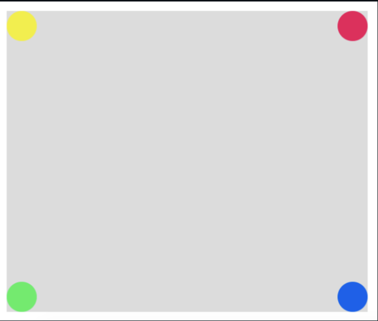
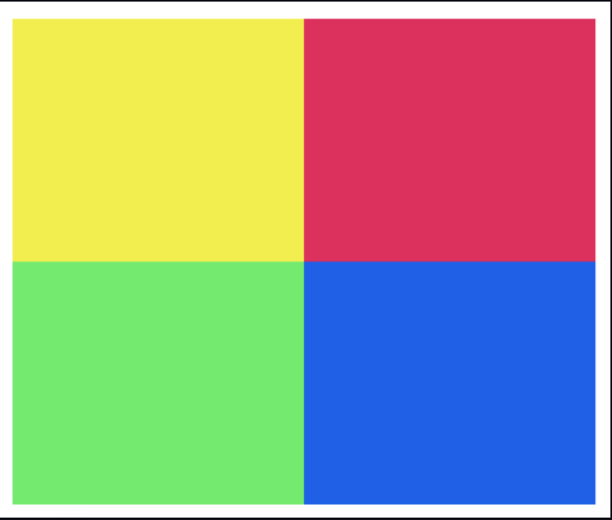

# p5.js Mockup Match

## The Goal

You've been given five digital works of art to recreate. Each one can be done using `fill()`, `ellipse()`, and other functions from the [p5.js documentation](https://p5js.org/reference/).

## Getting Started

If your team has more than 2 people, you should consider splitting into smaller groups of 2-3 each. **Group 1** will work in the file called `sketch1.js`, and **Group 2** will work in the file `sketch2.js`.
Follow the “confidence grouping” protocol your teacher explains to you.

The next seven slides have seven challenges of increasing difficulty. Your job is to work together with your partners to recreate these images as accurately as possible in the time we have. 

Try to finish at least through challenge 3. 

## The Lab

Recreate each of the following images:

#### Challenge 1

#### Challenge 2

#### Challenge 3

#### Challenge 4

#### Challenge 5

#### Challenge 6

#### Challenge 7

